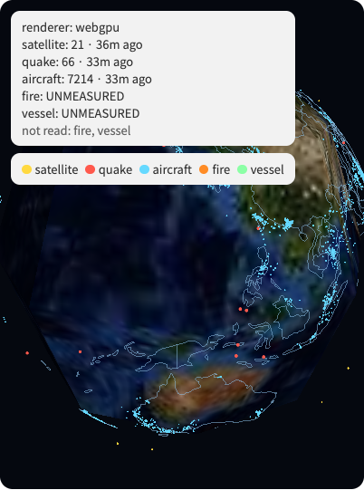
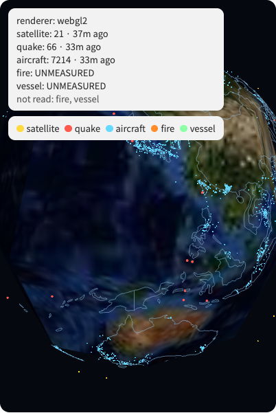

# app-tenkyu

**A spy-satellite view of the planet, drawn from a data lake instead of a
vendor's API.**

Live at **https://app-tenkyu.04-feasts-minded.workers.dev**

Satellites, earthquakes, aircraft, fires and vessels on a WebGPU globe.
Every mark, and the Earth underneath it, comes out of Cloudflare R2 Data
Catalog — ingested by [`cloud-itonami/tenkyu`](https://github.com/cloud-itonami/tenkyu),
governed, and read back through this Worker. **The browser never talks to
CelesTrak, OpenSky, USGS, NASA or Google.**



## What it is not

The design this follows draws its globe with **Google Photorealistic 3D
Tiles** and fetches every live feed from the browser. That means a metered
API key under every frame, five third-party availability dependencies, and
a rate limit between the reader and the planet.

Here the whole surface — imagery, coastlines, and every moving thing — is
in one bucket we own. The trade is honest and worth naming: the imagery is
NASA Blue Marble at zoom 5, not photorealistic 3D cities. What you get for
it is a page that works when Google is down, costs nothing per view, and
can say exactly where each pixel came from.

There is also no Cesium and no Three.js. The geometry is
[`kotoba-lang/geo`](https://github.com/kotoba-lang/geo), and the two
backends are written against it directly.

## Measured, live, 2026-08-26

```
renderer: webgpu
satellite: 21 · 4s ago      quake: 66 · 3m ago      aircraft: 7214 · 3m ago
fire: UNMEASURED            vessel: UNMEASURED
not read: fire, vessel
```

`UNMEASURED` is the point. NASA FIRMS needs a free key and AISStream needs
a resident WebSocket collector; neither has run, so those tables do not
exist. The API returns 404 with the reason, the UI says **UNMEASURED**, and
nobody can mistake *nobody is listening* for *the oceans are empty*.

## The Iceberg read, in ClojureScript, in a Worker

No Java, no DuckDB, no Spark. Four steps, all of them the ones a real
Iceberg client takes:

```
GET /v1/config                                    -> the catalog's prefix
GET /v1/{prefix}/namespaces/{ns}/tables/{table}   -> metadata, inline
R2  manifest-list, then each manifest   (Avro)    -> data file paths
R2  each data file                      (Parquet) -> rows
```

Steps 3 and 4 go through the Worker's **R2 binding**, so the data never
crosses the public internet and there is no second credential. The catalog
token reaches only the metadata face.

Two libraries in this workspace had to be fixed to make it work, and both
were silent failures rather than errors:

| | |
|---|---|
| [`org-apache-avro`](https://github.com/kotoba-lang/org-apache-avro) | accumulated varints with `Math.pow`, so a manifest's 64-bit `snapshot_id` was **already corrupted** before the decoder could decide to refuse it. It then refused the whole record — losing the `file_path` string beside it. |
| [`json`](https://github.com/kotoba-lang/json) | `(int \a)` is **0** on ClojureScript, not 97, so every `\uXXXX` escape containing a hex letter decoded to the wrong character. `日` gave 攅 where 日 was written. Its own tests were `.clj`. |

### Cached on the snapshot id, so staleness is impossible

Decoding 7,214 aircraft out of Parquet costs real CPU. The response is
cached on the Iceberg **snapshot id**, which changes exactly when and only
when the table does — a hit is provably current, and a miss happens once
per commit. A time-based TTL would be wrong in one direction or the other
at every moment.

The id is read out of the **manifest-list filename**, not the JSON number:
`JSON.parse` gives a double, and 4043499409833639796 comes back as
…640000. It still looks like an id, and it is the cache key.

| | cold | cached |
|---|---|---|
| satellite (21 rows) | 24.1 s | 1.3 s |
| quake (66 rows, 2 files) | 4.7 s | — |
| aircraft (7,214 rows, 327 KB) | 21.1 s | — |

## Satellites are elements, not positions

The lake stores each satellite's two-line element set — one row per
satellite per day. [`kotoba-lang/sgp4`](https://github.com/kotoba-lang/sgp4)
evaluates it **in your browser**, at the instant the frame is drawn. That
is the only reason a satellite table can be a thousand times smaller than
the aircraft one.

Deep-space element sets are **refused**, not approximated, and the refusal
count is on screen. A geostationary satellite pushed through the near-Earth
model comes back with a position that drifts hundreds of kilometres inside
a day, and nothing about the number says so.

## WebGPU, with a WebGL 2 fallback that is actually checked

Both backends consume the same vertex data from `globe/scene.cljc`, which
is pure `.cljc` — that is the only reason "the fallback draws the same
scene" is a claim anyone can test. `npm run test:browser` forces the
fallback by deleting `navigator.gpu` before the page loads, because Chrome
for Testing enables WebGPU by default and a flag-based attempt silently ran
WebGPU again and reported a pass.



23 checks, run against the deployed Worker. The ones worth having:

| check | why |
|---|---|
| the render loop is alive | a stopped loop and a loop drawing nothing look identical |
| the renderer was never rebuilt | see below |
| the fallback drew the same object count | 7301 = 7301, both backends |
| crossing a view did not load a document | the single-page rule, asserted rather than assumed |
| an UNMEASURED layer is named as such | the whole reason this app exists |

### Four bugs the browser test found that no unit test could

1. **The renderer drew into a detached canvas.** React 18's `createRoot`
   is a client render, not a hydration: it discards the server-rendered
   children of `#app`. The renderer, started on a `setTimeout 0`, held the
   old node — which kept its 402×600 buffer, accepted every draw call, and
   was not in the page. The frame counter passed 700. Nothing errored.
2. **Two renderers on one canvas.** `mount!` and the route listener both
   called `start-globe!` in the same tick, and the guard was on `:state`,
   which is only set when the create promise resolves.
3. **The whole globe was culled.** Visible tiles were selected by comparing
   each tile's *centre* against a fixed threshold — the correct formula
   with the tile's angular radius set to zero. At z0 there is one tile
   covering the planet, its centre is at (0,0), and the default camera at
   20N 140E culled it. Zero tiles requested, zero pixels drawn.
4. **Three CSS tokens that did not exist.** An app on a DADS base has no
   `shitsuke.hig` underneath, so `--hig-color-bg-elevated` resolved to
   *nothing* and the overlay's background silently vanished, leaving white
   text on the imagery. `views-test` now checks every token against
   `jp-go-dds.tokens/hig->dads`.

Measuring it was wrong twice, too, in opposite directions:
`createImageBitmap` returns a transparent bitmap for a **WebGPU** canvas,
and `toDataURL` returns a blank one for a **WebGL** canvas without
`preserveDrawingBuffer`. Both read as "nothing was drawn".

## Layout

```
src/app_tenkyu/
  route.cljc          views as data; the nav is generated from them   (shared)
  db.cljc             app state and every question the UI asks        (shared)
  views.cljc          jp-go-dds hiccup, and the SSR expander          (shared)
  globe/scene.cljc    positions, camera, culling -- no GPU type       (shared)
  propagate.cljc      TLE -> sub-satellite point, via sgp4            (shared)
  iceberg-id.cljc     how a snapshot is identified                    (shared)

  worker.cljs         the only namespace that touches Request/Response
  iceberg.cljs        catalog -> Avro manifests -> Parquet -> rows
  api.cljs            the JSON endpoints and the snapshot-keyed cache
  core.cljs           the mount, the render loop, the pointer
  events.cljs subs.cljs
  globe/webgpu.cljs   WebGPU backend
  globe/webgl.cljs    WebGL 2 backend
  globe/renderer.cljs capability detection and dispatch
```

Six of those are `.cljc` and shared between the Worker and the browser —
the page the server renders and the page the browser mounts are the same
function. `npm test` runs 41 tests / 2,977 assertions over them without a
browser or a GPU.

## Running it

```bash
npm install
npm test                       # 41 tests, no browser needed
npm run build                  # both bundles
npx wrangler secret put CF_CATALOG_TOKEN     # R2 Data Catalog: Read
npx wrangler deploy
npm run test:browser           # 23 checks against the deployed Worker
```

The custom domain is deliberately **not** claimed in `wrangler.jsonc`. A
custom domain belongs to exactly one Worker, the last deploy wins, and
neither side is told; net-kotobase records what that cost once, when
`git.kotobase.net` moved onto an empty store and 28 repositories started
answering `404 repository not found`.

## Naming

`app-tenkyu` is a **role**-plane name (`app-` + subject), the established
form in this org. 天球 (tenkyu) is the celestial sphere; the name does not
describe the function, so it is said here and registered in
`manifest/concept-vocabulary.edn`.

## What it does not do

No named-person search, no face recognition, no tracking of individuals.
The ingest actor keeps `icao24`, `callsign` and `mmsi` because a
transponder broadcasts them in the clear, and refuses any field whose name
marks a person. Every source is public, every licence is on the Sources
page, and every layer says whether it was actually read.
